# LTspice-Projects

A Simulink-like power electronics simulation environment built on LTspice, featuring ready-to-use circuit libraries and custom tools.

## Features ✨

- **Optimized Models for Convergence**: Includes circuit models specifically designed to enhance simulation convergence.
- **Transparent Model Definitions**: All models are defined using LTspice schematic files (.asc), allowing users to view and edit the circuits directly as needed.
- **Extensive example circuits**: A wide range of example circuits covering DC-DC converters, resonant converters, Totem-Pole PFC, motor drivers, battery charger, and digitally controlled power stages.

## Symbols 🧩

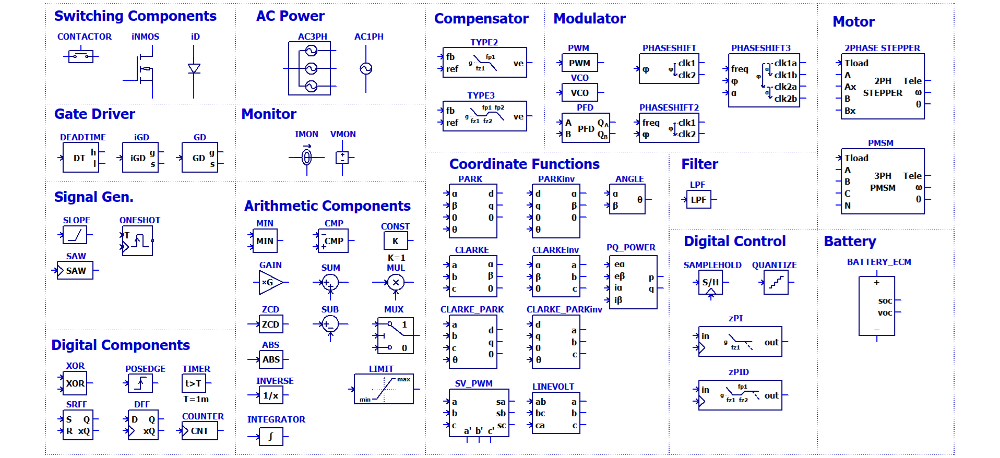

## Example Screen Shots 🖼️

### Type-II Compensator (FRA)
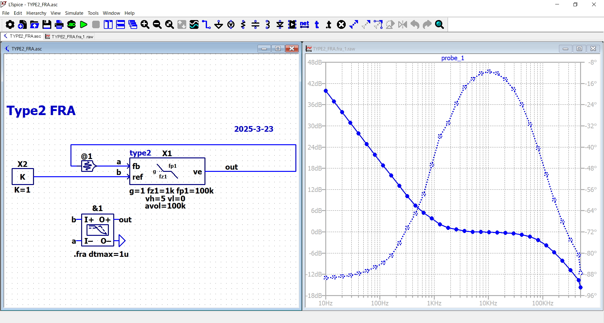

### Peak Current Mode Buck Converter (Current-Mode Control)
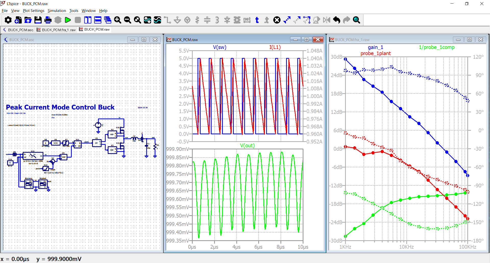

### Peak Current Mode Boost Converter (Current-Mode Control)
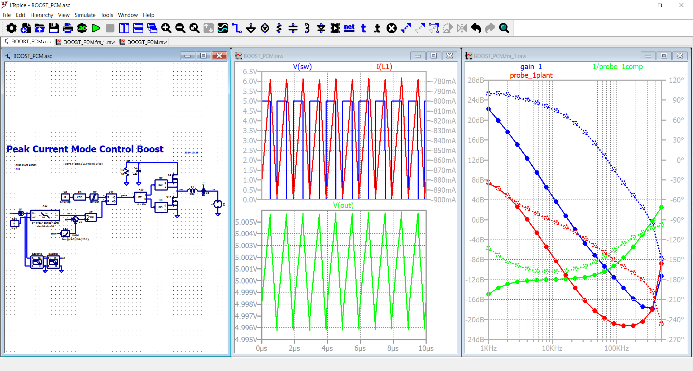

### CCCV Buck Converter for Battery Charging (CC/CV control)
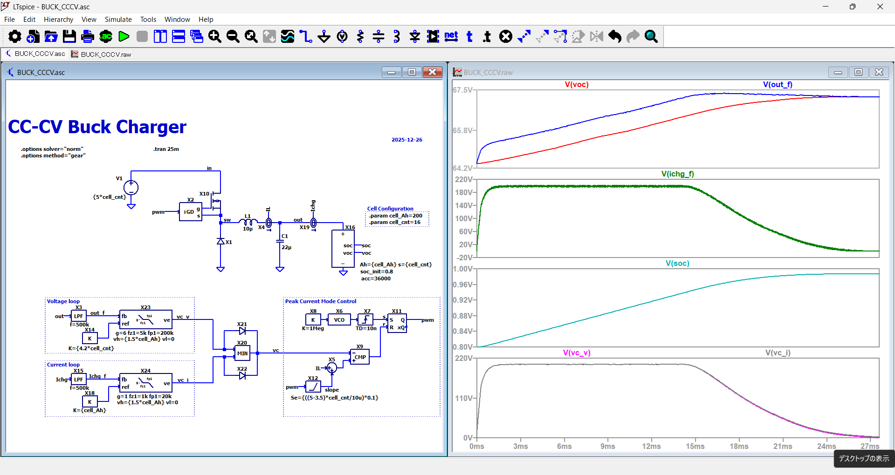

### Boundary Conduction Mode Flyback Converter (BCM / CrCM)
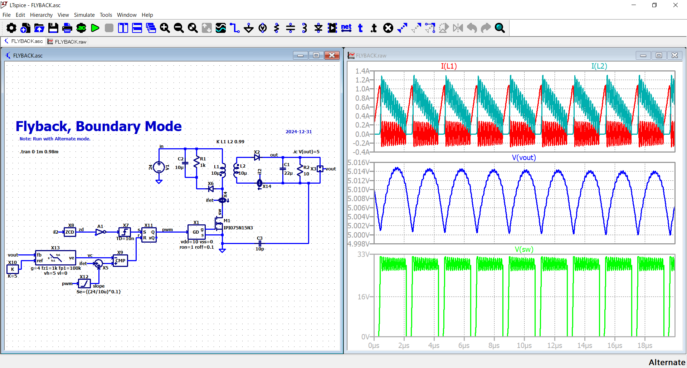

### Phase-Shift Full-Bridge Converter (PSFB with ZVS)
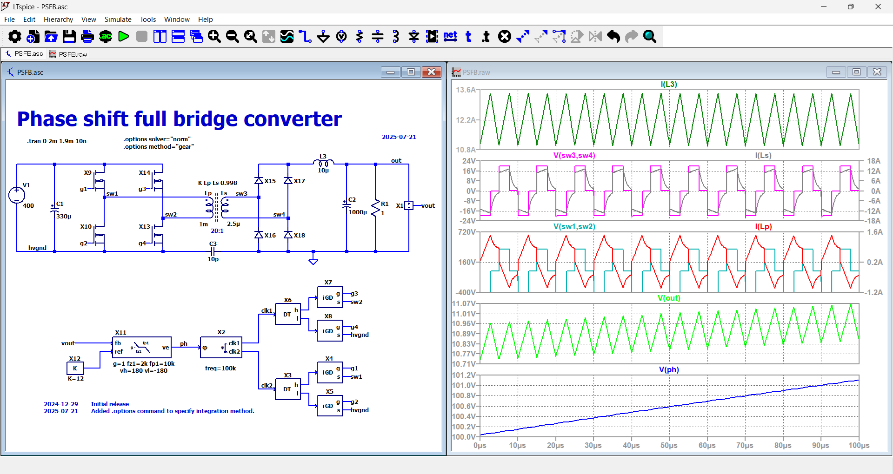

### LLC Resonant Converter (Frequency Control)
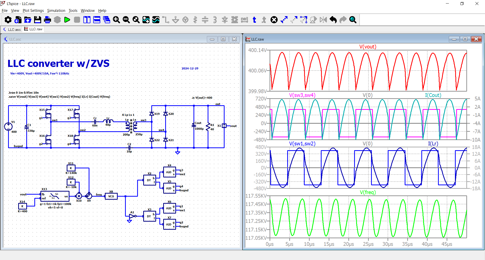

### Single-Phase Totem-Pole PFC (2-Phase Interleaved)
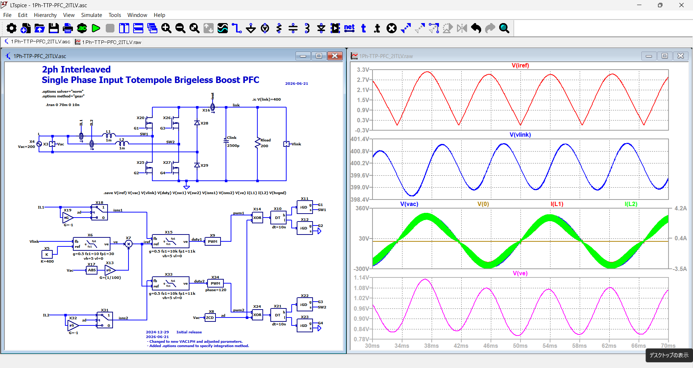

### Single-Phase 4-Level Totem-Pole PFC
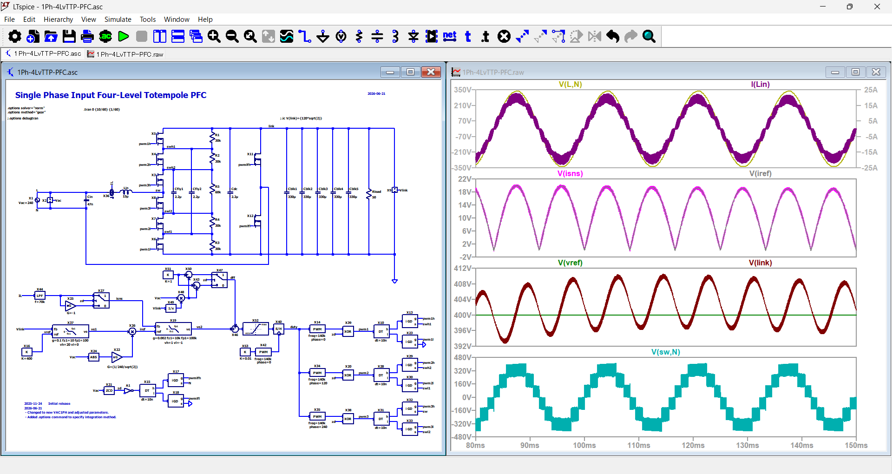

### Three-Phase Totem-Pole PFC (VOC + SVPWM Control)
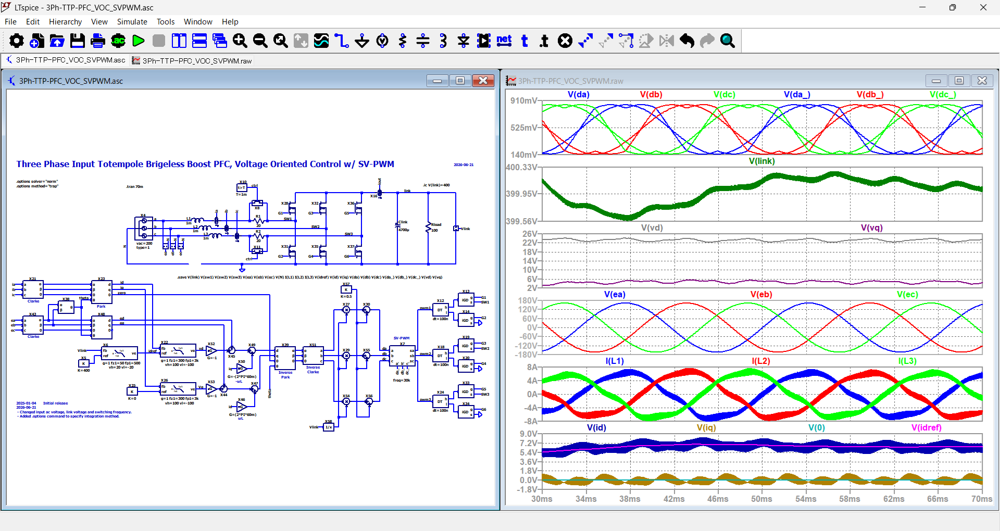

### Discrete-Time PID Controller (Z-Domain FRA)
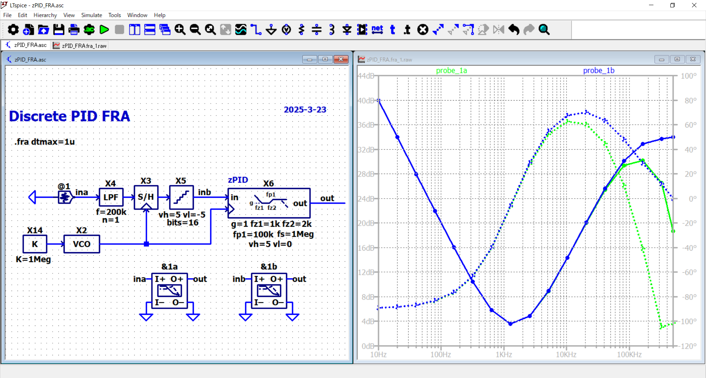

### Discrete-Time Voltage-Mode Buck Converter (Digital Control)
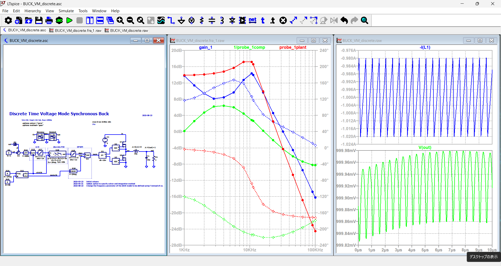

### Two-Phase Stepper Motor Control using FOC
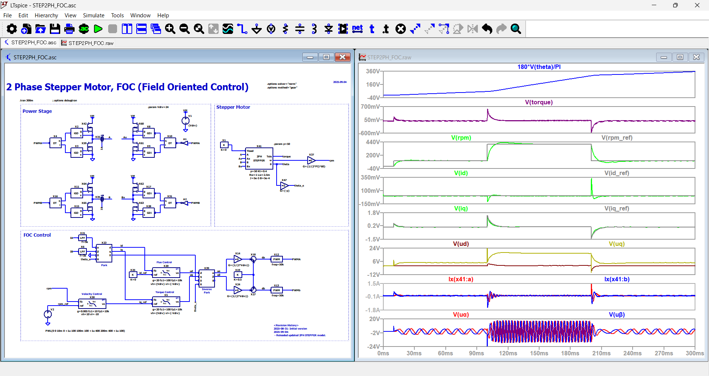

### Neural-Network Controlled Buck Converter using pytorch2ltspice
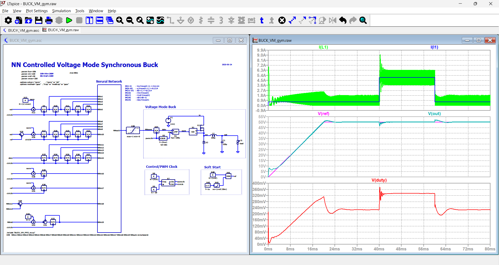

## License

MIT
